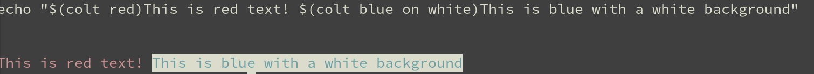

# colt: a tool for getting terminal color codes

`colt` is a tool for getting terminal color codes. It uses a trivial syntax; aims to be similar to `tput` for terminals. Embed `colt` in shell scripts for maximum effect.

## Install

`go get github.com/erikh/colt`

## Example

Pass a color to `colt` in a shell to print its terminal definition ("escape code"), like so:

```bash
#!/bin/bash

echo "$(colt red)This is red text! $(colt blue on white)This is blue with a white background!"
```



## Syntax

There are three positions in the grammar that are relevant:

Foreground is always in the first position. Specify `white` if you want to stick to standard text.

If you want to specify a background, specify it or use "on" to specify it with
a bit more of an english twist.

If you want to specify text attributes such as bold, underline, etc, specify them with "with", such as:

```
colt red with bold underline
colt red on white with bold
```

"Hi" colors, or colors with slightly more on bits switched on are brighter colors (and also, subject to different rules on older terminals WRT backgrounds, so read up about that). These colors start with `hi` such as `hired` or `hiwhite`.

[All the keywords are here](https://github.com/erikh/colt/blob/main/maps.go).

## Author

Erik Hollensbe <github@hollensbe.org>

## License

MIT
